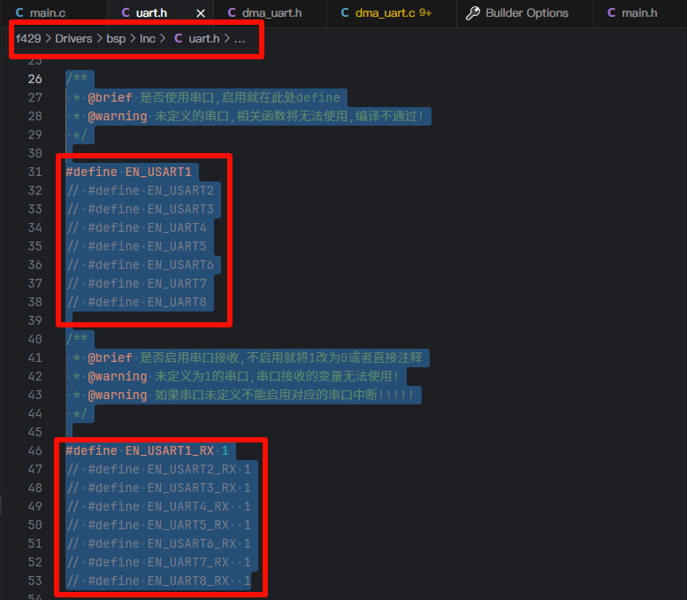
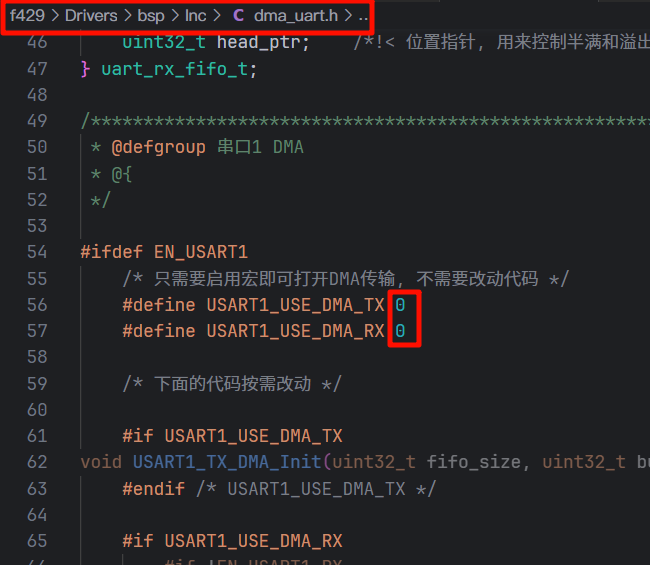

# STM32F103新建工程模板文件（精简版）

这个模板相较于之前的裁剪了其他芯片的文件，只保留了`stm32f103xx`的文件，体积更小，移动复制更方便。

根据正点原子Mini板子编写，包括一个DMA串口收发。项目结构参照正点原子。

编译烧录以后可以观察到跑马灯，当按下按键以后串口会提示按下的按键，串口会提示发送数据，当发送以后数据会回传回来。

除串口5外都可以使用DMA收发。串口1经过1.28Mbps压力测试，未发现数据丢失；其他串口未测试。

## 注意

必须使用AC6编译器，AC5编译器编译无法通过。建议把Keil MDK升级到最新版本（网盘里的就是最新的，具体参照我写的工具链部分）。

我设置的警告等级较高，编译会有较多警告，大多是隐式类型转换或者未定义宏的警告，无需理会。但是要是你自己写的函数有警告，要注意些，仔细想一想这样有没有问题。

## 文件结构

```
│  .gitignore                    Git仓库push时忽略的文件和目录列表
│  f103_Template.code-workspace  EIDE工程文件, 双击就可以直接打开vscode
│  ClearBuild.bat                清除keil编译生成的文件, 只保留hex文件
│  README.md                     项目文档
│  f103_Template.uvoptx          keil工程文件
│  f103_Template.uvprojx         keil工程文件
├─.cmsis                         CMSIS支持包(不要随便修改)
├─.eide                          EIDE工程项目依赖(不要随便修改)
├─.pack                          芯片支持包(在线下载)
├─assets                         说明文档图片目录
├─build                          EIDE工程编译目录
├─Drivers                        底层驱动代码
│  ├─bsp                         BSP(Board Support Pack)板层驱动, 以前的Hardware目录, 驱动硬件的底层代码放在此处
│  ├─CMSIS                       CMSIS支持包(不要随便修改)
│  ├─STM32F4xx_HAL_Driver        HAL库(不要随便修改)
│  └─system                      包括STM32时钟设置代码和延时代码
├─Middlewares                    中间层代码, 用于板层和应用层之间
├─Output                         Keil编译输出
└─Application                    应用层, 一般放应用层代码
    ├─Inc
    └─Src
       └─ main.c                 main函数文件
```

由于我们不需要用到分散加载文件，所以正点原子的`User`我直接换成了`Application`。

`bsp, Middlewares, Application`中都添加了`Third_Party`，用来添加第三方组件，`#include`时使用相对路径。

`Include Path`根据需求改动，不是固定的。

工程文件我直接放在了根目录，这样用vscode管理文件的时候就比较方便了。

## 串口使用说明

由于串口的IO相对固定，而且我把所有串口的初始化都写了，因此没有用宏定义的方式定义串口IO。

Template默认只打开了串口1，没有使用DMA。

要打开其他串口到`Drivers\bsp\Inc\uart.h`中打开相应的宏开关（取消注释）。并在`uart.c`的`HAL_UART_RxCpltCallback`函数中编写相应的接受代码。



如果要使用DMA到`Drivers\bsp\Inc\dma_uart.h`打开对应的宏开关（0改成1），注意先在`uart.h`中打开对应的串口。



有关DMA串口的使用，参见串口压力测试函数。

`uart_print`函数可以使用任意串口打印，第一个参数是串口句柄指针，也就是`&U(S)ARTx_Handler`，第二个参数就和`printf`一样，可以用`%d, %s`，后面跟变量。DMA不会影响`uart_print`和`printf`向串口发数据。

`uart_print`和`printf`建议仅在调试时使用，不要在通信中使用。
